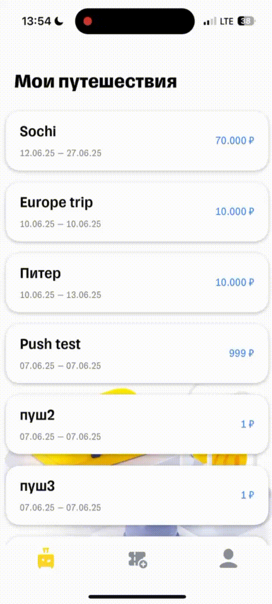

# TTravelTogether

<div align="center">
  
</div>

## Overview

TTravelTogether is an iOS application that extends the T-Bank's travel service by enabling users to organize group trips, manage shared expenses, and coordinate with travel companions. The app helps users plan trips, track expenses, and automatically calculate shared costs among participants.

## Features

## Authentication Module
This module provides user authentication functionality, including both login and registration screens.
### Features
- **User Registration:**  
  Users can create new accounts via the registration screen, with input validation to ensure data integrity.
- **User Login:**  
  Existing users can log in securely using their credentials.
- **JWT Token Support:**  
  Upon successful authentication, a JWT (JSON Web Token) is issued. This token is used to authorize subsequent requests and manage user sessions securely.
- **Validation:**  
  All user input is validated both on the client side and before authentication, ensuring only valid data is processed.


### 🏷️ Trip Management
- Create and manage group trips with start and end dates
- Add participants via contacts or phone numbers
- Track trip status and participant confirmations
- View trip details and statistics


### 💰 Expense Management
- Set and track overall trip budget
- Categorize expenses (tickets, hotels, food, entertainment, insurance, etc.)
- Record individual and group expenses
- Automatic calculation of shared costs and debts
- View expense history and summaries


### 👥 User Management
- Secure user authentication
- Profile management
- Contact synchronization
- Push notifications for important updates
- Offline mode support with caching



### 🔐 Security & Data Management
- Secure data storage using CoreData and KeyChain
- Encrypted data transmission
- Privacy-first approach
- Secure authentication system

### 🎨 UI/UX Features
- Skeleton loading animations for better user experience
- Smooth transitions between screens
- Dark mode support
- Custom UI components
- Responsive layouts

## Technical Implementation

### Requirements
- Swift 5+
- Xcode 13+
- iOS 14+
- CocoaPods for dependency management
- SwiftLint for code style enforcement

### Architecture
- MVVM (Model-View-ViewModel) architecture
- Coordinator pattern for navigation
  - Centralized navigation management
  - Type-safe routing
  - Deep linking support
  - Flow-based navigation
  - Dependency injection for coordinators
- Protocol-oriented programming
- Dependency injection with Swinject

### Key Components
- **Views**: UIKit-based UI components with programmatic layout (SnapKit)
- **ViewModels**: Business logic and data management
- **Models**: CoreData entities and business objects
- **Services**: Network, storage, and utility services
- **Utils**: Helper functions and extensions
- **Coordinators**: Navigation flow management
  - AppFlowCoordinator: Main application flow
  - Feature-specific coordinators
  - Deep link handling
  - Navigation state management

### Dependencies
- SnapKit for programmatic UI
- URLSession for networking
- CoreData for local storage
- KeyChain for secure storage
- SwiftLint for code style

### Testing
- Unit tests
- Clean architecture principles
- Code reusability

## Project Structure

```
TTravelTogether/
├── App/
│   ├── AppDelegate.swift
│   └── SceneDelegate.swift
├── Modules/
│   ├── LoginScreen/
│   ├── RegistrationScreen/
│   ├── MyTripsScreen/
│   ├── CreateTrip/
│   ├── Transactions/
│   └── Profile/
├── Custom/
│   ├── Views/
│   │   ├── SkeletonViews/
│   │   └── Components/
│   ├── Extensions/
│   └── Utils/
├── Resources/
│   ├── Assets.xcassets
│   └── Localization/
├── Service/
│   ├── Network/
│   └── Storage/
├── Model/
├── Protocols/
├── Coordinator/
│   ├── AppFlowCoordinator.swift
│   ├── ICoordinator.swift
│   └── FeatureCoordinators/
├── Factory/
├── Support/
├── Errors/
├── Formatter/
├── Observers/
└── Fonts/
```

## Features Implementation

### Core Features
- ✅ Programmatic UI with UIKit and SnapKit
- ✅ Dark mode support
- ✅ Localization (Russian/English)
- ✅ Caching
- ✅ Push notifications
- ✅ Contact synchronization
- ✅ CoreData/KeyChain integration
- ✅ Custom views and components
- ✅ Skeleton loading animations
- ✅ Coordinator-based navigation

### Code Quality
- ✅ SwiftLint integration
- ✅ Unit tests
- ✅ Clean architecture
- ✅ Code reusability
- ✅ Protocol-oriented programming
- ✅ Dependency injection

## Getting Started

### Prerequisites
- Xcode 13.0 or later
- iOS 14.0 or later
- CocoaPods
- Swift 5.0 or later
